# Hello, FastAPI World
Учебный проект на Python/FastAPI: 4 эндпоинта, Pydantic‑валидация, кастомные ошибки в едином формате, автодокументация Swagger UI (/docs).

## Структура проекта
```text
hello-fastapi/
├── main.py
├── requirements.txt
├── README.md
└── .gitignore
```

## Зависимости
Версии зафиксированы в `requirements.txt`:

- fastapi==0.115.0
- uvicorn[standard]==0.30.6
- pydantic==2.9.2

## Установка
```bash
pip install -r requirements.txt
```

## Запуск
```bash
uvicorn main:app --reload --host 0.0.0.0 --port 8000
```

## Проверка в браузере
- `http://localhost:8000/docs` - Swagger UI.
- `http://localhost:8000/redoc` - ReDoc.
- `http://localhost:8000/openapi.json` - OpenAPI JSON.

## Эндпоинты
### 1) GET /
Ответ (200 OK) — пример формата (timestamp генерируется текущий, UTC, ISO с Z):
```json
{
  "message": "Hello, FastAPI!",
  "timestamp": "2026-01-30T00:00:00Z",
  "version": "1.0.0"
}
```

```bash
curl -i http://localhost:8000/
```

### 2) POST /echo
Входной JSON:
```json
{
  "name": "Иван",
  "age": 25
}
```

Ответ (201 Created):
```json
{
  "greeting": "Привет, Иван!",
  "adult": true,
  "status": "success"
}
```

Пример (успех):
```bash
curl -i -X POST "http://localhost:8000/echo" \
  -H "Content-Type: application/json" \
  -d '{"name":"Иван","age":25}'
```

Пример (ошибка валидации → 400 Bad Request, ErrorResponse):
```bash
curl -i -X POST "http://localhost:8000/echo" \
  -H "Content-Type: application/json" \
  -d '{"name":"","age":200}'
```

Формат ошибки (пример):
```json
{
  "error": "....",
  "code": "VALIDATION_ERROR"
}
```

### 3) GET /echo/{name}
Пример: GET /echo/Алексей

Ответ (200 OK):
```json
{
  "message": "Привет, Алексей!",
  "uppercase": "АЛЕКСЕЙ"
}
```

Пример:
```bash
curl -i "http://localhost:8000/echo/Алексей"
```

### 4) GET /secret/{token}
Если token == "admin" → 200 OK:
```json
{
  "secret": "Секретный доступ открыт!"
}
```

Иначе → 401 Unauthorized (ErrorResponse):
```json
{
  "error": "Доступ запрещён",
  "code": "INVALID_TOKEN"
}
```

Примеры:
```bash
curl -i "http://localhost:8000/secret/admin"
curl -i "http://localhost:8000/secret/wrong"
```

## Скриншоты (обязательно)

Swagger UI со всеми 4 эндпоинтами  


Вызовы эндпоинтов с ответами через Postman  
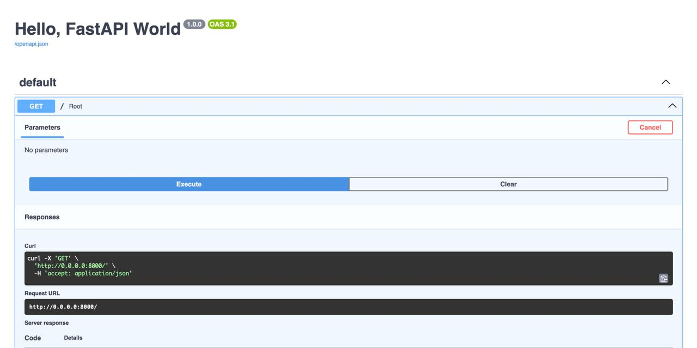
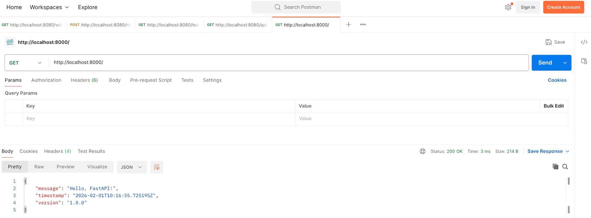
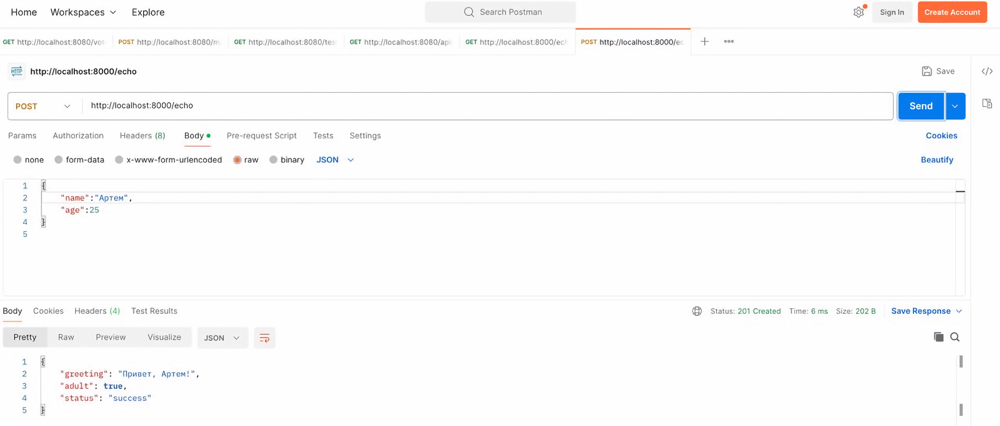
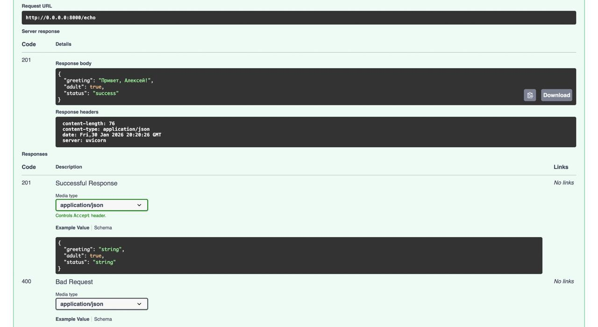
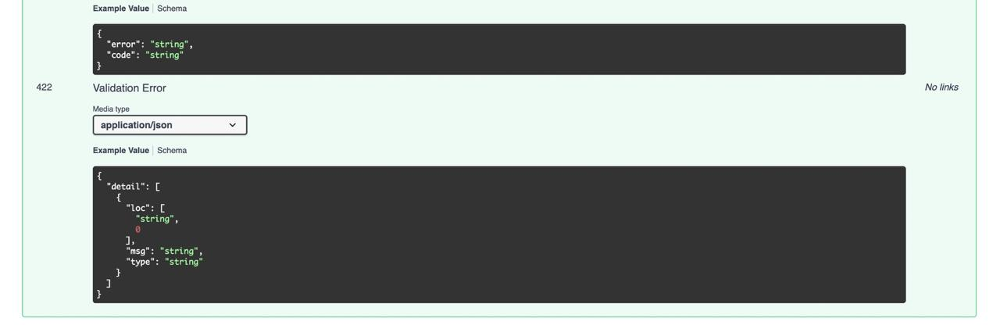
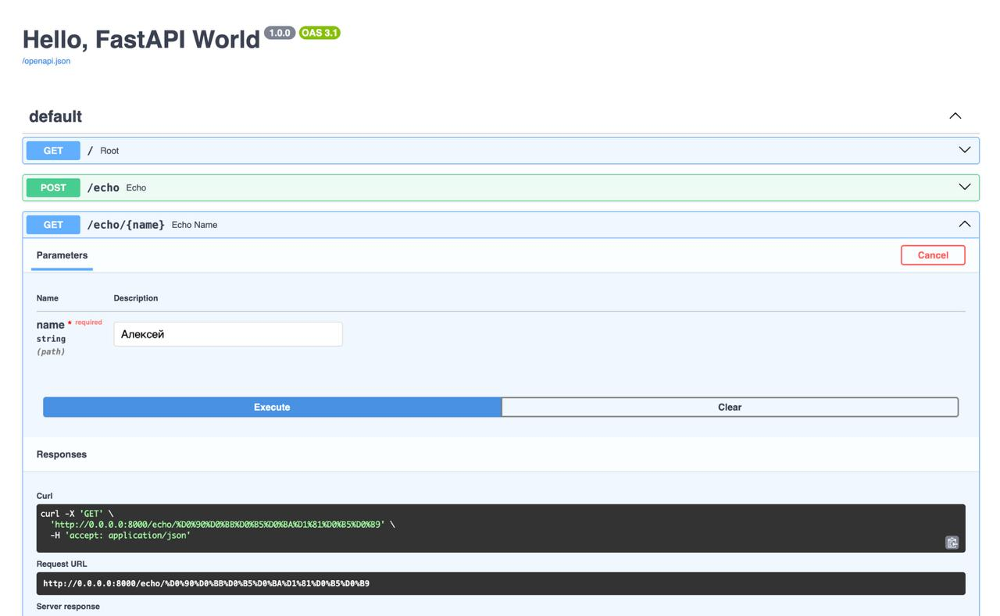
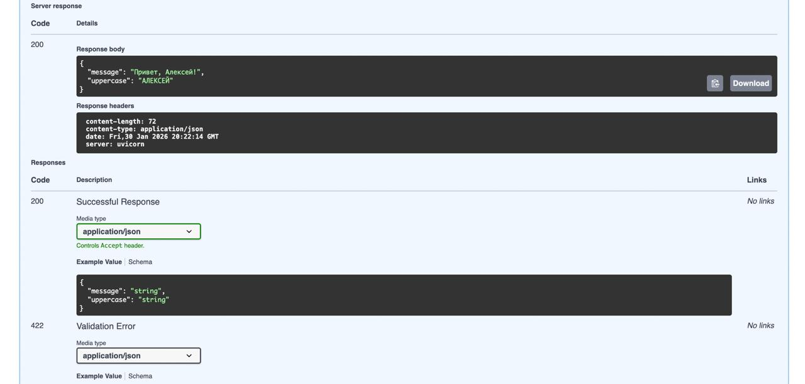

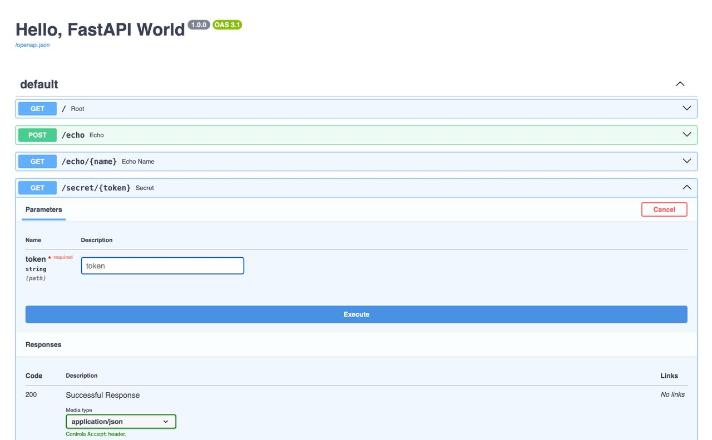
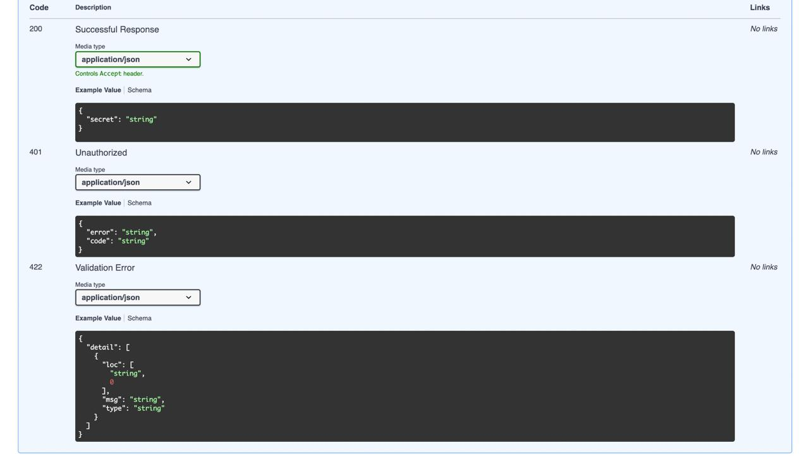

Успешный POST /echo из браузера (Swagger UI)  
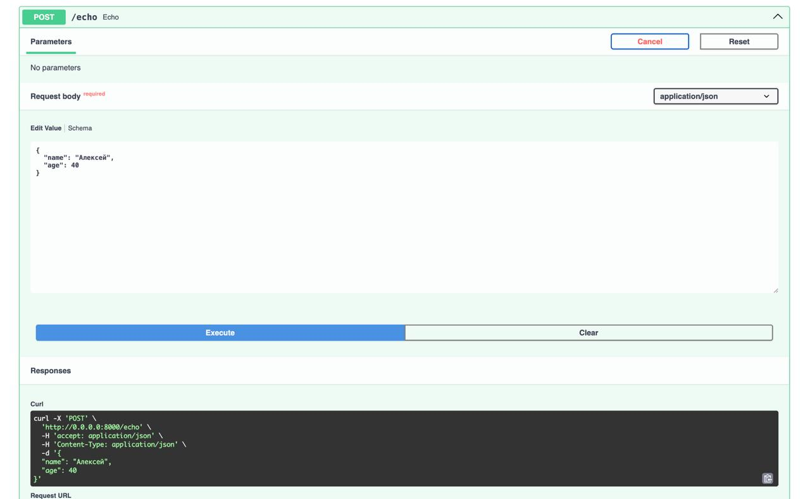
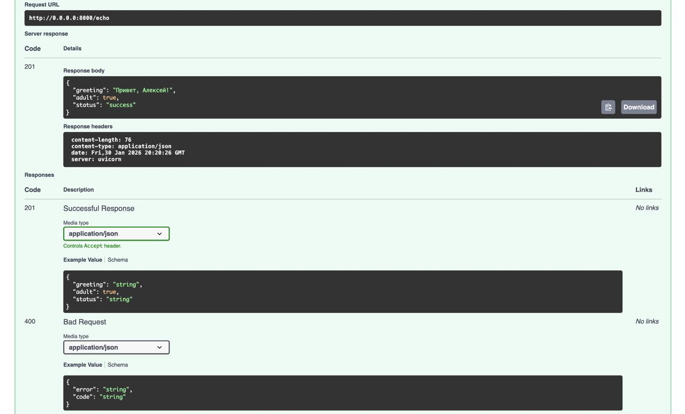
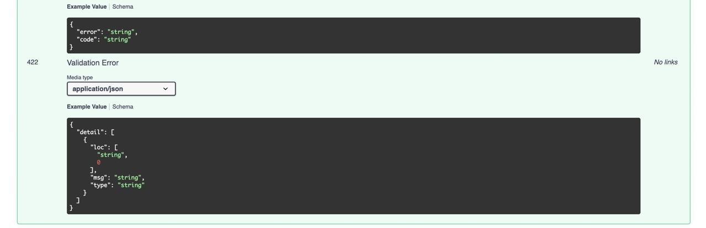

Ошибка 401 на /secret/wrong  
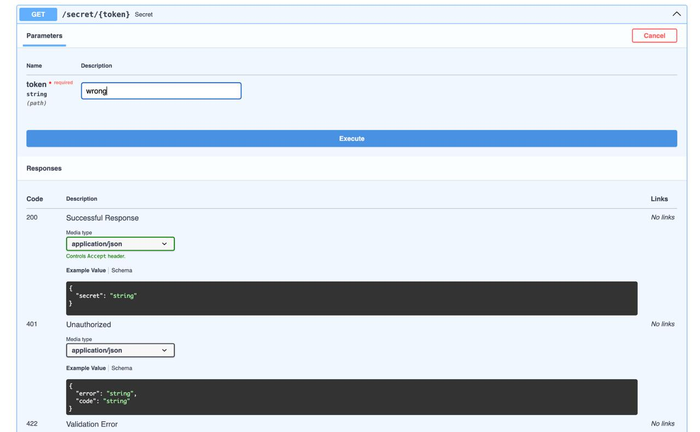
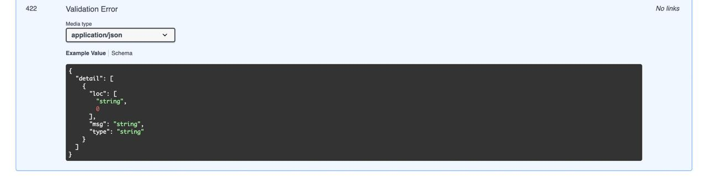
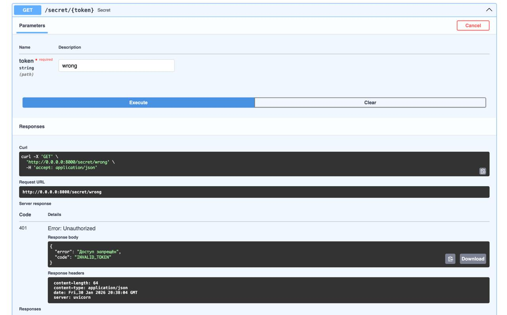
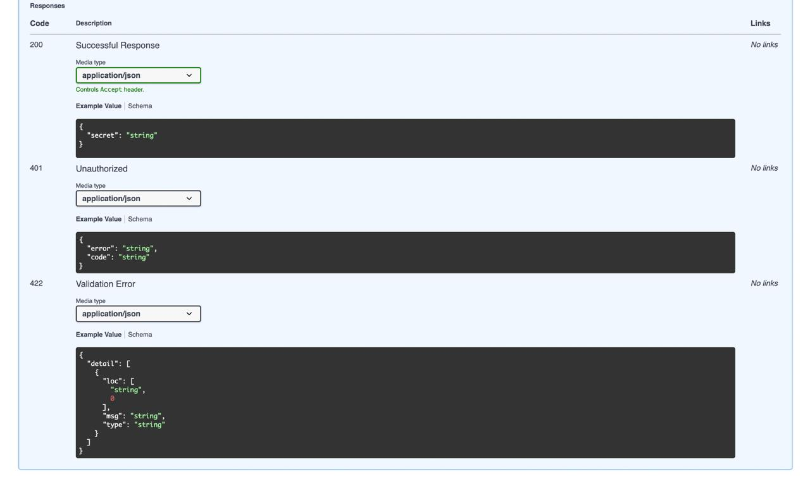
